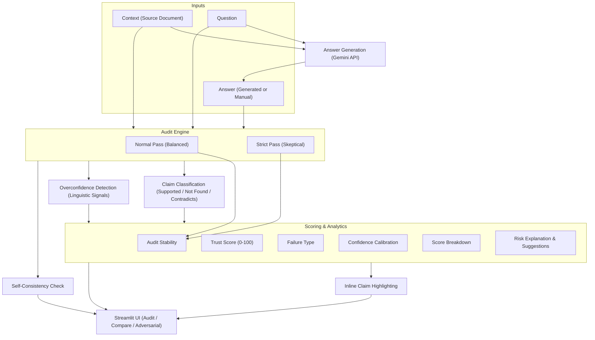

<div align="center">

# 🛡️ TruthLens

### *AI Trust Layer — Hallucination Detection & Reliability Auditing for LLM Outputs*

[](https://python.org)
[](https://streamlit.io)
[](https://github.com/yourname/TruthLens)
[](LICENSE)

> **"Don't trust. Verify. Quantify."**  
> TruthLens intercepts LLM outputs and subjects them to a multi-layer forensic audit — grounded entirely in your own context.

</div>

---

## ⚡ What is TruthLens?

TruthLens is a **context-aware hallucination detection system** supporting multiple AI providers. It takes an AI-generated answer, deconstructs it into individual factual claims, and cross-references every single one against a provided source document — assigning trust scores, classifying failure modes, and producing actionable human-readable verdicts.

Test with **any AI model**: Google Gemini, OpenAI, Anthropic Claude, local Ollama models, or the included **Mock provider** (no API keys needed).

No external knowledge. No assumptions. Just your context vs. the model's output.

---

## 🧠 Core Capabilities

| Feature | Description |
|---|---|
| 🔬 **Claim-Level Auditing** | Decomposes answers into atomic factual claims and classifies each as `Supported`, `Not Found`, or `Contradicts` |
| 📊 **Trust Scoring** | Deterministic 0–100 score computed from contradiction/hallucination deductions |
| 🎯 **Failure Type Classification** | Automatically labels the primary failure mode: *Contradiction · Unsupported Claim · Overconfidence Bias · Mixed Issues* |
| 🎭 **Confidence Calibration** | Detects linguistic overconfidence — flags answers using strong language (`"definitely"`, `"always"`) despite low factual grounding |
| 🧮 **Score Breakdown** | Transparent per-category deduction table: contradictions, unsupported claims, overconfidence signals |
| 🔁 **Multi-Pass Audit** | Runs Normal + Strict audit modes in parallel; computes score divergence and **Audit Stability** rating |
| 🔄 **Self-Consistency Check** | Independent pass to detect internal logical contradictions *within* the answer itself |
| 🎨 **Inline Highlighting** | HTML-rendered answer with color-coded claim spans and overconfidence word detection |
| ⚠️ **Risk Explanation** | Dynamic "Why This Is Risky" bullets generated from audit results |
| 💡 **User Guidance** | Contextual suggested actions (verify, cite, re-prompt, fix) tailored to the specific failure type |
| ✨ **Grounded Fix** | Rewrites the answer strictly from context, removing or correcting every ungrounded claim |
| ⚖️ **Side-by-Side Model Comparison** | Audit the same question across two models from any provider simultaneously |
| 🧨 **Adversarial Testing** | Generates convincing-but-incorrect answers to stress-test the auditor's detection limits |
| 🤖 **Multi-Provider Support** | Use Gemini, OpenAI, Anthropic Claude, Ollama, or Mock provider for testing |
| 🧪 **Mock Provider Testing** | Test all features without API keys using the included Mock provider |

---

## 🏗️ Architecture



---
## 🚀 Quick Start

### 1. Clone & set up environment

```bash
git clone https://github.com/yourname/TruthLens.git
cd TruthLens
python -m venv venv
venv\Scripts\activate        # Windows
# source venv/bin/activate   # macOS / Linux
pip install -r requirements.txt
```

### 2. Choose Your Provider

#### Option A: Test with Mock Provider (Recommended for First Time)
✅ **No API keys needed** — perfect for trying everything out

```bash
python test_multi_provider.py
# In sidebar: Provider → "mock"
```

#### Option B: Use Gemini
Head to [Google AI Studio](https://aistudio.google.com/) → **Create API Key**, then:
```bash
streamlit run app.py
# In sidebar: Provider → "gemini", paste your API key
```

#### Option C: Use Local Ollama (Free)
```bash
# Install: https://ollama.ai/
ollama pull mistral
ollama run mistral

# In another terminal:
streamlit run app.py
# In sidebar: Provider → "ollama"
```

#### Option D: Use OpenAI or Anthropic
Same setup as Gemini — just select different provider and paste your API key

### 3. Launch

```bash
streamlit run app.py
```

Open `http://localhost:8501` in your browser.

---

## 📐 Scoring Model

```
Trust Score = 100
             − 25 × [Contradictions]
             − 10 × [Unsupported Claims]
             −  5 × [Overconfidence Signals]
             (floor: 0)

Risk Level:   80–100 → Low
              50–79  → Medium
               0–49  → High
```

### Overconfidence Signals Detected

`definitely` · `always` · `never` · `certainly` · `obviously` · `proven` ·  
`undeniably` · `absolutely` · `without a doubt` · `it is clear that` · `everyone knows` · `experts say`

---

## 🧪 Testing

### Test Without Any API Keys

```bash
python test_multi_provider.py
```

**Output:**
```
✅ Mock provider initialized
✅ Available models: mock-fast, mock-standard, mock-detailed
✅ Audit result: Trust Score 100, Risk Low
✅ All critical tests passed!
```

See [TESTING_GUIDE.md](TESTING_GUIDE.md) for complete testing scenarios.

---

## 📁 Project Structure

```
TruthLens/
├── app.py                     # Streamlit UI — multi-provider support
├── auditor.py                 # Core logic — provider-agnostic auditing
├── model_provider.py          # Multi-provider abstraction layer
├── test_multi_provider.py     # Test suite (no API keys needed)
├── requirements.txt           # Python dependencies
├── MULTI_PROVIDER_GUIDE.md    # Detailed provider setup guide
├── TESTING_GUIDE.md           # Testing scenarios & troubleshooting
└── tests.py                   # Basic smoke tests
```

### Key modules

**`auditor.py`** — Core auditing logic (provider-agnostic)

| Function | Role |
|---|---|
| `run_audit()` | Main audit pipeline — calls any provider, parses JSON, recomputes score |
| `classify_failure_type()` | Derives primary failure label from claim mix |
| `detect_confidence_calibration()` | Compares linguistic tone vs. actual trust score |
| `score_breakdown()` | Per-category deduction breakdown |
| `audit_stability_indicator()` | Normal vs. strict score gap → stability rating |
| `explain_risk()` | Dynamic risk + action bullets from audit results |
| `build_highlighted_answer()` | HTML-annotated answer with partial-match claim highlighting |
| `check_consistency()` | Intra-answer logical contradiction detection |

**`model_provider.py`** — Multi-provider abstraction layer

| Class | Role |
|---|---|
| `ModelProvider` | Abstract base class for all providers |
| `GeminiProvider` | Google Gemini API adapter |
| `OpenAIProvider` | OpenAI API adapter |
| `AnthropicProvider` | Anthropic Claude API adapter |
| `OllamaProvider` | Local Ollama models adapter |
| `MockProvider` | Test provider (no API calls) |
| `get_provider()` | Factory function to instantiate providers |
| `GenerateConfig` | Unified config across all providers |

---

## 🎛️ Providers & Models Supported

| Provider | Models | Setup |
|---|---|---|
| 🔷 **Google Gemini** | `gemini-2.5-flash`, `gemini-2.5-pro`, `gemini-2.0-flash`, `gemini-1.5-pro` | [Get API Key](https://aistudio.google.com/) |
| 🟠 **OpenAI** | `gpt-4o`, `gpt-4-turbo`, `gpt-4`, `gpt-3.5-turbo` | [Get API Key](https://platform.openai.com/api-keys) |
| 🪶 **Anthropic Claude** | `claude-3-5-sonnet`, `claude-3-5-haiku`, `claude-3-opus` | [Get API Key](https://console.anthropic.com/) |
| 🦙 **Ollama (Local)** | `mistral`, `llama2`, `neural-chat`, `starling-lm` | [Install Ollama](https://ollama.ai/) |
| 🧪 **Mock (Testing)** | `mock-fast`, `mock-standard`, `mock-detailed` | No setup needed |

**Use any provider for answer generation, any for evaluation — or stick with one for the entire workflow.**

---

## 🧪 Adversarial Mode

TruthLens ships with a built-in **red-teaming tool**. It instructs Gemini to generate a *convincing but subtly incorrect* answer — wrong dates, swapped names, fabricated numbers — then immediately audits it under strict mode. Use it to:

- Benchmark the auditor's sensitivity
- Demonstrate hallucination risks to stakeholders
- Tune your prompting strategy

---

## 🤝 Contributing

Pull requests are welcome. For major changes, open an issue first.  
Please ensure new audit logic is covered in `tests.py`.

---

<div align="center">

Built with 🛡️ by humans who don't blindly trust AI outputs.

</div>
